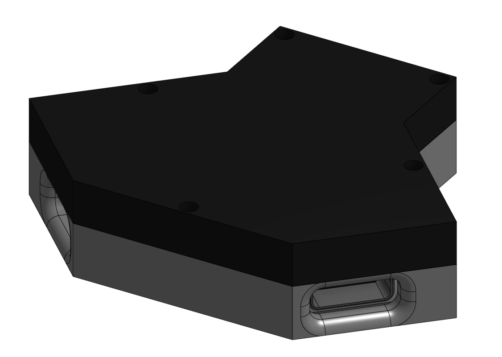

# August 21st
Began working on project. Looked at the USB-C pinouts for both alternate modes and power delivery. Started and completed the schematic. Started working on PCB.

**Total time spent: ~2h**

# August 23rd
Okay... The USB-C footprints I chose are kinda annoying to work with. After messing around a little bit I found one that I liked and was able to route it. I also changed the schematic a little by changing one of the symbols. Exported for jlcpcb production. I fixed the 3d models for the foot print I used, then I exported the PCB as a step file for use in onshape. Did the casing for the board. Then worked on making this repository meet grounded requirements.

**Total time spent: ~2h**

# August 24th
I completely forgot to do differential pair length tuning... so I had to fix that. I also completely forgot to turn on wakatime for KiCAD :sob:

**Total time spent: ~1h**
