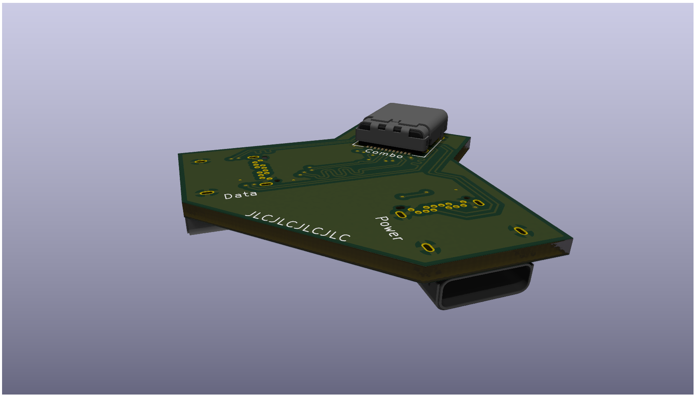

This is a board that splits up two usb-c connectors and combines it into one, one for power and one for data. This is useful in situations where you need usb PD but the device doesn't support it or unable to output it.

